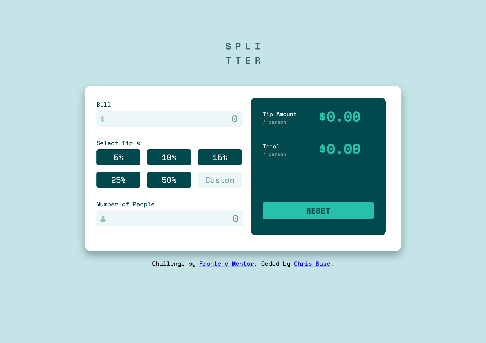

# Frontend Mentor - Tip calculator app solution

This is a solution to the [Tip calculator app challenge on Frontend Mentor](https://www.frontendmentor.io/challenges/tip-calculator-app-ugJNGbJUX). Frontend Mentor challenges help you improve your coding skills by building realistic projects.

## Table of contents

- [Overview](#overview)
  - [The challenge](#the-challenge)
  - [Screenshot](#screenshot)
  - [Links](#links)
  - [Built with](#built-with)
  - [What I learned](#what-i-learned)
- [Author](#author)

## Overview

This challenge was to create a tip calculator to calculate how much a person/persons will pay when the user provides the bill total, the amount of tip they wish to leave, and how many people the bill is going to be spread to.

### The challenge

Users should be able to:

- View the optimal layout for the app depending on their device's screen size
- See hover states for all interactive elements on the page
- Calculate the correct tip and total cost of the bill per person

### Screenshot

### Links

- Live Site URL: [Live Site](https://chris-base.github.io/Tip-Calculator-App/)
- Solution URL: [My Solution](https://www.frontendmentor.io/solutions/tip-calculator-app-made-with-html-sass-and-javascript-3NI5t3f8H)

### Built with

- Semantic HTML5 markup
- CSS custom properties
- SASS/SCSS
- Flexbox
- CSS Grid
- Mobile-first workflow
- JavaScript

### What I learned

I learned a lot about how to manipulate DOM elements and adding functionionality to buttons/data being passed by the user.

## Author

- Website - [Chris Base](https://github.com/chris-base)
- Frontend Mentor - [@chris-base](https://www.frontendmentor.io/profile/chris-base)